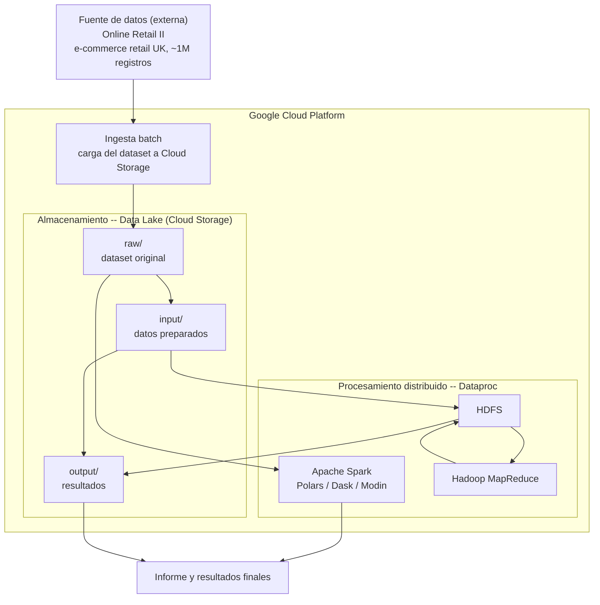
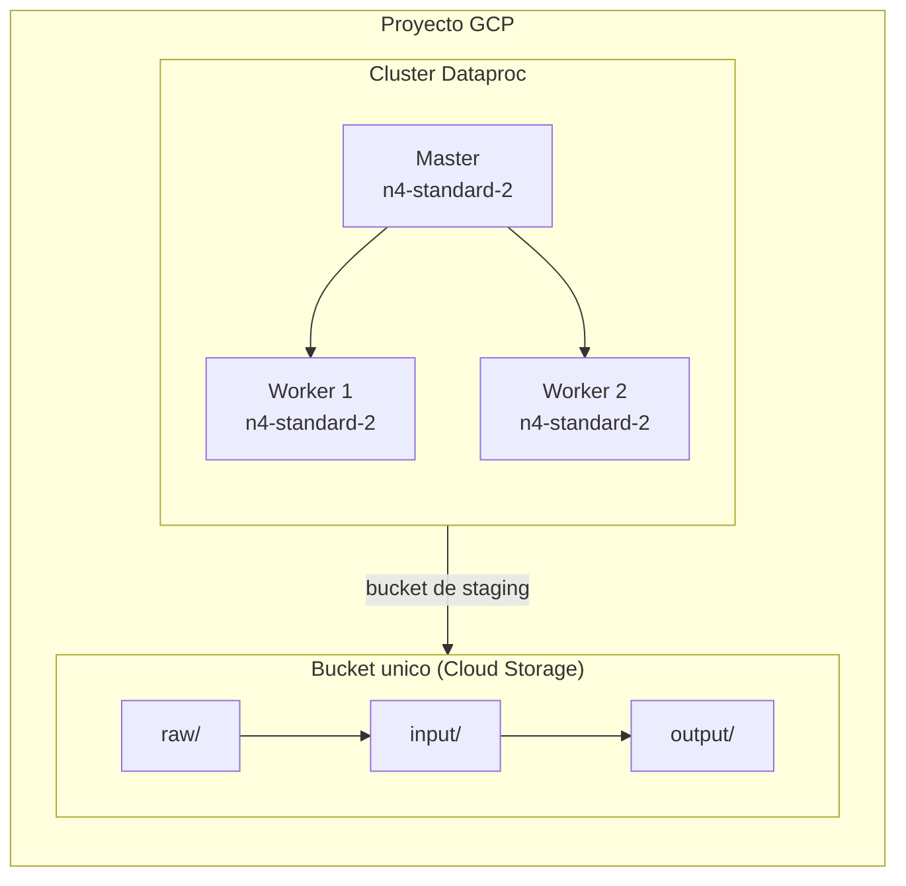
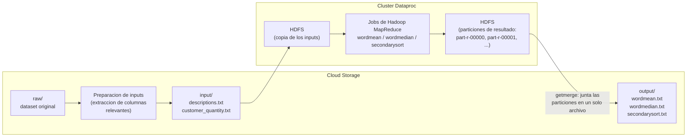

# Diseño de Arquitectura Big Data

Arquitectura del proyecto: fuente de datos → ingesta (batch) → almacenamiento (data lake) → procesamiento distribuido, completamente dentro de Google Cloud Platform.

> Versiones interactivas y pulidas de los 3 diagramas de esta página (para el informe) están en `docs/diagrams/`: `arquitectura-general.html`, `infraestructura-gcp.html` y `pipeline-hadoop-mapreduce.html`. Abrir directamente en el navegador — incluyen tema claro/oscuro y exportación a PNG/SVG.

## 1. Arquitectura general

## 2. Explicación de componentes

| Componente | Qué es | Por qué está ahí |
|---|---|---|
| **Fuente de datos** | `Online Retail II` — transacciones de e-commerce retail (Reino Unido), ~1.06M filas | Dataset con contexto real de negocio (retail) y volumen suficiente para justificar procesamiento distribuido |
| **Ingesta (batch)** | Carga del dataset completo a Cloud Storage | Es batch (no streaming) porque el dataset es un histórico fijo, no un flujo continuo de eventos |
| **Almacenamiento — Data Lake** | Un bucket de Cloud Storage organizado en 3 zonas (`raw/`, `input/`, `output/`) | Cloud Storage separa cómputo de almacenamiento (persiste aunque el clúster se borre); las 3 zonas simulan las etapas típicas de un data lake: cruda, preparada, y resultados |
| **Procesamiento distribuido** | Clúster Dataproc (1 master + 2 workers) corriendo Spark, Polars/Dask/Modin, y HDFS + Hadoop MapReduce | Dataproc administra Spark + Hadoop + HDFS de forma nativa sobre GCP, con el conector a Cloud Storage integrado |

## 3. Justificación técnica

- **GCP + Dataproc:** Dataproc integra Spark, Hadoop y HDFS con el conector a Cloud Storage ya configurado, sin tener que instalar/administrar cada pieza por separado.
- **Un solo bucket:** cumple dos roles (staging del clúster y data lake del proyecto) organizados por carpetas — separarlo en dos buckets no aporta nada funcional distinto para este tamaño de proyecto.
- **Hardware del clúster:** `n4-standard-2` (2 vCPU, 8GB RAM) x3 nodos (1 master + 2 workers) con disco `hyperdisk-balanced` de 100GB.
- **Batch, no streaming:** el dataset es un archivo histórico cerrado, no llegan registros nuevos en tiempo real
- **Terraform:** toda la infraestructura se define como código y se provisiona/destruye de forma reproducible — ver `terraform/README.md`.

---

## 4. Infraestructura GCP (detalle)

**Notas:**
- El clúster no tiene IP pública — el acceso es por SSH vía IAP tunneling o por el Component Gateway (JupyterLab, Spark History Server), nunca IP directa.
- Toda esta infraestructura se define como código (Terraform) y se recrea/destruye con un solo comando — ver `terraform/README.md`.

---

## 5. Pipeline de Hadoop MapReduce (flujo de datos)

**Notas:**
- Cada job se envía vía la API de Dataproc (`gcloud dataproc jobs submit hadoop`), que hace polling del estado del job sin depender de una conexión persistente al clúster.
- `getmerge` es el paso que junta todas las particiones de salida (`part-r-00000`, `part-r-00001`, ...) en un solo archivo legible.
- El detalle operativo (comandos exactos, cómo correrlo) está en `hadoop-mapreduce/README.md`.
